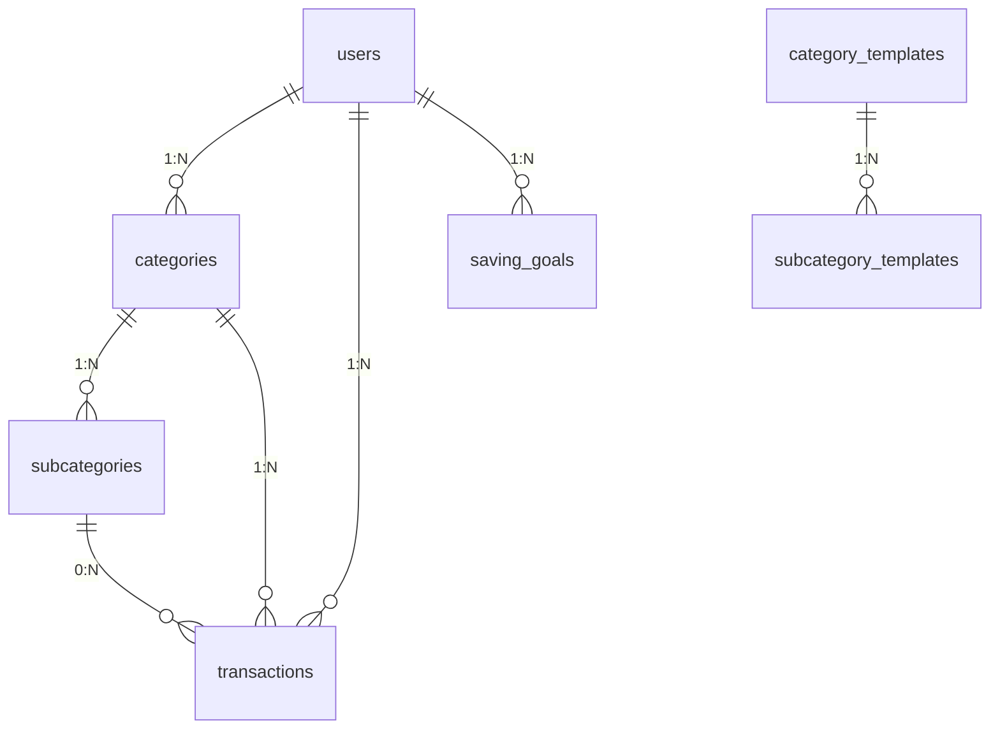

# Banco de dados — Mind Money

Schema MySQL/MariaDB (InnoDB, utf8mb4), aplicado e testado contra um
MariaDB/MySQL real. Este README documenta o desenho original do schema
(`schema.sql`, as 6 tabelas de base) e o raciocínio por trás dele — ainda
válido e não revisado desde então. As 11 tabelas adicionadas depois via
`database/migrations/001` a `010` (notificações, score, objetivos,
educação financeira, gamificação, favoritos, tokens de sessão/reset,
newsletter) **não** estão detalhadas aqui tabela a tabela; a lista completa
e atualizada, com o papel de cada uma, está em
**[`../DOCUMENTATION.md`](../DOCUMENTATION.md)** seção 4.

## Arquivos

| Arquivo | O que é |
|---|---|
| `schema.sql` | DDL completo: banco, tabelas, relacionamentos, índices, constraints, a procedure de seed |
| `seed.sql` | Dados iniciais dos templates de categoria/subcategoria (espelha `defaultCategories.ts`) |
| `create_app_user.sql` | Cria um usuário MySQL com privilégios mínimos para o backend usar (nunca `root`) |
| `test_integrity.sql` | Suíte de teste que exercita cada constraint (positiva e negativa) e limpa tudo no final |

## Como aplicar

```
mysql -u root < database/schema.sql
mysql -u root < database/seed.sql
mysql -u root < database/create_app_user.sql   # ajuste a senha antes
mysql -u root --force -t < database/test_integrity.sql   # opcional, valida tudo
```

## Estrutura



`category_templates`/`subcategory_templates` não têm relação com `users` —
são a fonte fixa dos padrões, independentes de qualquer conta.

**As 6 tabelas de base do `schema.sql`**: `users`, `categories`,
`subcategories`, `transactions`, `saving_goals`, e o par
`category_templates`/`subcategory_templates`. Na época em que este schema
foi desenhado, score financeiro, notificações, relatórios, perfil e
configurações ainda não tinham tabela **de propósito** — nenhuma dessas
funcionalidades existia em lugar nenhum do app, e criar as tabelas antes da
lógica estar decidida seria modelar no escuro. Cada uma entrou numa
migration própria quando a funcionalidade correspondente foi de fato
construída (todas já existem hoje — ver `DOCUMENTATION.md` seção 4):

- **Score financeiro**: continua sendo dado derivado de `transactions` +
  `saving_goals`, calculado sob demanda — mas hoje também é cacheado em
  `financial_score_history` (migration 002), justamente para permitir
  "evolução do score ao longo do tempo" sem recalcular tudo a cada consulta.
- **Notificações**: `notifications` (migration 001), gerada como efeito
  colateral real de transações/metas — nunca por um endpoint manual.
- **Perfil e configurações**: ainda não ganhou tabela própria — segue como
  antes (dark mode no browser, sem tela de configurações de conta).

## Decisões por tabela

**`users`** — só o necessário para autenticar: nome, e-mail (`UNIQUE` +
`CHECK` de formato básico), hash de senha. Nada de `email_verified_at`,
`last_login_at` ou tabela de perfil separada — nenhuma dessas telas existe.

**`category_templates` / `subcategory_templates`** — a razão de existir:
`categories.user_id` é `NOT NULL`, então não dá para inserir "categorias
padrão" direto em `categories` sem já ter um usuário. Os templates são a
fonte única e sem dono, e a procedure `sp_seed_user_categories(user_id)`
copia eles para a conta de um usuário recém-criado. Isso é o que o backend
vai chamar logo depois do `INSERT` em `users` no cadastro.

**`categories` / `subcategories`** — por usuário (preserva a customização já
implementada no front). Usam **soft delete** (`archived_at`) em vez de
exclusão física: no protótipo atual, a categoria de uma transação é só uma
string solta, então apagar uma categoria não mexe em transações antigas. Com
uma FK de verdade isso precisa ser diferente — arquivar tira a categoria da
lista de opções sem quebrar o histórico.

**`transactions`** — `amount` é sempre `DECIMAL(12,2)` (nunca
`FLOAT`/`DOUBLE`, para não ter erro de arredondamento com dinheiro).
`category_id` é `ON DELETE RESTRICT` **de propósito**: nenhuma categoria com
transações pode ser apagada, só arquivada — isso é uma proteção, não uma
limitação. `subcategory_id` é `ON DELETE SET NULL`: apagar uma subcategoria
não pode derrubar a transação inteira, só perder aquele detalhe.

**`saving_goals`** — uma linha por usuário/mês (`UNIQUE(user_id,
reference_month)`), com `CHECK` no formato `YYYY-MM`, no mesmo formato que
`SavingGoals` já usa no front.

## Uma consequência real do `RESTRICT`, encontrada testando

`fk_transactions_category` é `RESTRICT`. Isso significa que um simples
`DELETE FROM users WHERE id = ?` **falha** se o usuário tiver qualquer
transação — o MySQL tenta cascatear a exclusão das categorias (via
`users → categories ON DELETE CASCADE`), e o `RESTRICT` em
`transactions.category_id` barra essa exclusão no meio do caminho.

Isso foi verificado rodando `test_integrity.sql` contra o banco de
verdade (passo 12) e é **intencional, não um bug**: um sistema financeiro
não deveria permitir que o histórico de transações suma como efeito
colateral de apagar uma conta. Por isso, apagar uma conta é uma operação em
duas etapas, nunca um `DELETE FROM users` solto:

```sql
DELETE FROM transactions WHERE user_id = ?;
DELETE FROM users WHERE id = ?; -- agora cascateia limpo até o fim
```

O backend deve implementar "excluir conta" assim — e esse é o lugar natural
para, no futuro, adicionar confirmação extra, exportação de dados antes de
apagar, etc.

## Segurança

- Senha do usuário sempre com hash (bcrypt, feito na aplicação — a coluna
  `password_hash` só guarda o hash, nunca a senha em texto puro).
- `create_app_user.sql` cria um usuário MySQL (`mindmoney_app`) sem
  `DROP`/`ALTER`/`CREATE`/`GRANT` — só `SELECT`/`INSERT`/`UPDATE`/`DELETE`/
  `EXECUTE` (o `EXECUTE` é para chamar a procedure de seed). Testado: esse
  usuário consegue `SELECT` mas um `DROP TABLE` é negado
  (`ERROR 1142 (42000)`). O backend deve se conectar com ele, nunca com
  `root`.
- `CHECK` constraints validam formato de e-mail, cor (hex `#RRGGBB`) e mês
  (`YYYY-MM`) no próprio banco — validação de aplicação continua necessária,
  isso é só a segunda linha de defesa.

## Testado contra

MariaDB 10.4.32 (via XAMPP, rodando localmente). `test_integrity.sql` cobre:
inserção válida, e as seguintes falhas esperadas — `amount` negativo, e-mail
mal formado, categoria duplicada por usuário, cor inválida, mês inválido em
meta, FK para categoria inexistente, exclusão de categoria em uso — mais o
comportamento de `SET NULL` (subcategoria) e o `CASCADE` completo (usuário →
categorias/subcategorias/transações/metas) na ordem correta.

## Migrations aplicadas depois deste desenho original

Em ordem, cada uma criando o que a funcionalidade correspondente precisava
(detalhes de cada tabela em `DOCUMENTATION.md` seção 4):

| # | O que adiciona |
|---|---|
| 001 | `notifications` |
| 002 | `financial_score_history` |
| 003 | `newsletter_subscribers` |
| 004 | `password_reset_tokens` |
| 005 | `refresh_tokens` |
| 006 | `financial_objectives` / `objective_contributions` |
| 007 | `priority` em `financial_objectives` |
| 008 | `lesson_progress` (educação financeira) |
| 009 | `xp_events` / `user_achievements` (gamificação) |
| 010 | `favorites` |

Aplicar tudo, em ordem, depois de `schema.sql` + `seed.sql`:

```bash
for f in database/migrations/*.sql; do
  mysql -u root --default-character-set=utf8mb4 < "$f"
done
```
