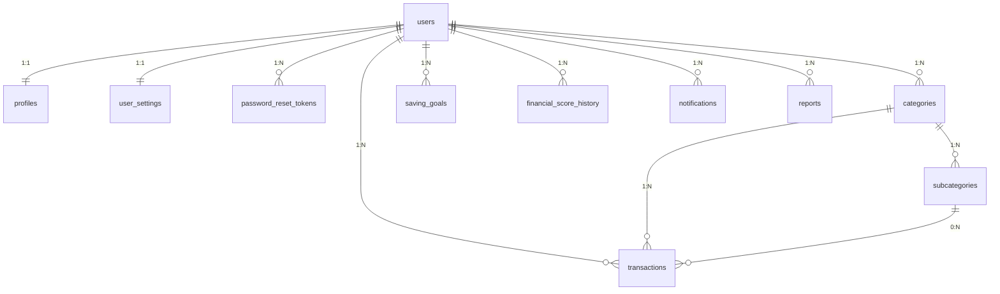

# Schema MySQL — Mind Money

Schema em [schema.sql](schema.sql), desenhado a partir dos tipos já usados no
front (`src/types/index.ts`, `src/features/*/hooks`) e das funcionalidades
futuras definidas na análise de arquitetura (auth, score financeiro, notificações,
relatórios). Ainda não há backend neste repositório — este é o artefato da
etapa 3 do plano; a etapa de scaffolding do backend consome este schema depois.

## Diagrama

## Decisões de design (e por quê)

**Categorias continuam por usuário, não globais.** O front já implementa
categorias/subcategorias customizáveis por usuário (`useCategories`), com cor
automática para as novas. Migrar isso para uma taxonomia global quebraria essa
funcionalidade já construída — `categories.user_id` preserva o comportamento
atual. Cada novo usuário recebe uma cópia das categorias padrão (mesmos nomes/
cores de `src/features/categories/data/defaultCategories.ts`) no cadastro —
isso é responsabilidade do backend (INSERT em lote no registro), não do schema.

**Categoria usa `archived_at` em vez de exclusão definitiva.** No protótipo
atual, `category` é só uma string solta em cada transação — apagar uma
categoria não afeta transações antigas, que continuam mostrando o nome antigo
como texto. Com uma FK de verdade (`transactions.category_id`), apagar a linha
quebraria a integridade referencial das transações existentes. A solução usada
aqui é **soft-delete** (`archived_at`): a categoria some da lista de opções
para novas transações, mas o histórico continua íntegro. Isso é uma evolução
deliberada em relação ao protótipo em localStorage, não um "quebra de
funcionalidade" — é o comportamento correto quando existe integridade
referencial real.

**Valores monetários são sempre `DECIMAL(12,2)`**, nunca `FLOAT`/`DOUBLE` —
evita erros de arredondamento em cálculos financeiros.

**Datas de transação são `DATE`, não `DATETIME`.** O front só usa `yyyy-mm-dd`
(`<input type="date">`), sem horário.

**Metas (`saving_goals`) e score (`financial_score_history`) são chaveados por
`reference_month` (`CHAR(7)`, formato `'YYYY-MM'`)**, igual ao `SavingGoals`
(`Record<"yyyy-mm", number>`) que já existe no front — mantém o mesmo
particionamento mensal que toda a lógica de comparação/evolução já usa.

**Score financeiro tem só uma tabela (`financial_score_history`), não duas.**
O relatório da etapa 1 sugeria `financial_score` (atual) +
`financial_score_history`. Consolidei em uma só: o score "atual" é sempre a
linha mais recente por usuário (`ORDER BY reference_month DESC LIMIT 1`).
Manter as duas tabelas exigiria sincronizar o valor "atual" toda vez que o
histórico mudasse — fonte de bugs sem benefício real, já que a consulta do
mais recente é trivial com o índice único `(user_id, reference_month)`.

**`reports` guarda só o log de exportações geradas (PDF/CSV/JSON), não os
dados do relatório em si.** A visualização de relatórios em tela é sempre uma
consulta direta em `transactions` — não há necessidade de persistir dados
derivados que podem ficar desatualizados.

**Autenticação: só `users` + `password_reset_tokens` por enquanto.** Não há
tabela de sessão/refresh-token aqui de propósito — essa decisão depende da
estratégia de auth (JWT vs. sessão) que é da etapa de backend, não do
modelo de dados. `password_reset_tokens` entra porque "esqueci minha senha"
é praticamente universal em qualquer fluxo de auth e não depende dessa escolha.

**Chaves primárias `BIGINT UNSIGNED AUTO_INCREMENT`** em vez de UUID — mais
simples, mais rápido para índices/joins no MySQL. Se no futuro os IDs
precisarem ser não-sequenciais (expostos em URLs públicas, por exemplo), dá
para adicionar uma coluna `public_id` (UUID) depois sem quebrar nada.

## Mapeamento com os tipos do front

| Tipo/hook no front | Tabela |
|---|---|
| `Transaction` (`src/types/index.ts`) | `transactions` |
| `Category` + `subcategories[]` | `categories` + `subcategories` |
| `SavingGoals` (`Record<mês, valor>`) | `saving_goals` |
| tema, `alertPercent` (hoje fixo em 70) | `user_settings` |
| — (novo) | `financial_score_history`, `notifications`, `reports` |

## Próximos passos

Este schema ainda não está aplicado em nenhum banco — é o ponto de partida
para a etapa de backend (scaffolding da API, ORM/migrations, seed das
categorias padrão no cadastro). Quando o backend for criado, este SQL deve
virar migrations versionadas (Prisma Migrate, Knex, etc.) em vez de um script
único aplicado à mão.
